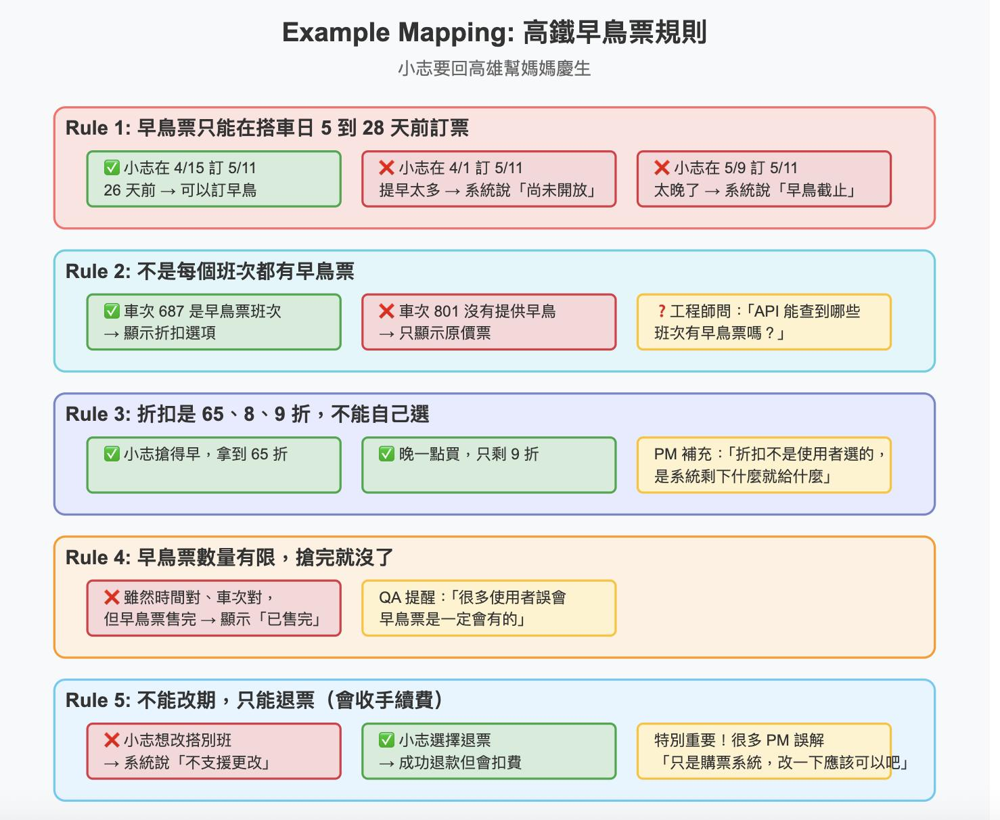

# Test Case

description:  

Template for analyzing business rules and transforming them into concrete test cases with system implications.

## Prompt Reference

[Specification by Example](https://www.facebook.com/story.php?story_fbid=1229487279185068&id=100063714233564&post_id=100063714233564_1229487279185068&rdid=t5gNYSpjBGxe3qWt#)

[如何利用 ChatGPT 開出好的測試個案](https://www.facebook.com/story.php?story_fbid=1037746901692441&id=100063714233564&mibextid=oFDknk&rdid=ufPBaHk4DY4xnRO6#)

---

## Prompt

Write down the final test cases in a table. The steps are as follows:
- Identify the inputs.
- Identify equivalent classes: valid and invalid classes.
- Calculate the number of test cases (total and useful).
- Make combinations.
- Set up the test case table.

## 規則說明（Rule Description）
- **名稱**：`<規則名稱>`
- **類型**：`business_rule`
- **描述**：  
  `<用白話描述這條商業規則是什麼，例如來自 PM 的口頭說明>`

## 範例組（Examples）

| 範例名稱        | Given（前提）            | When（操作）   | Then（結果） | 必測  |
| --------------- | ------------------------ | -------------- | ------------ | ----- |
| `<例子 1 名稱>` | `<系統狀態、使用者條件>` | `<使用者行為>` | `<系統反應>` | v / x |
| `<例子 2 名稱>` | `<...>`                  | `<...>`        | `<...>`      | v / x |
| `<例子 3 名稱>` | `<...>`                  | `<...>`        | `<...>`      | v / x |

## 系統影響（System Implication）
- `<這條規則對 UI、API、DB 設計可能產生的具體影響>`
- `<跨部門需要注意的地方，例如與客服、行銷同步規則>`
