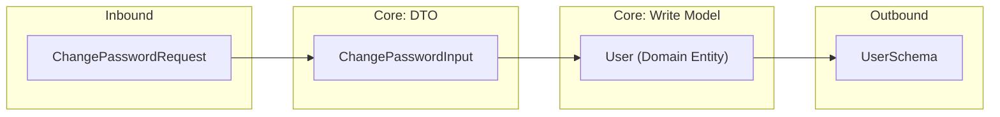
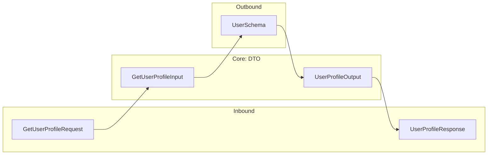
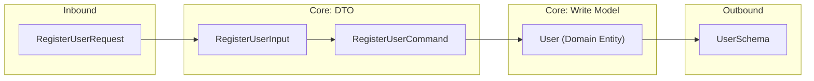
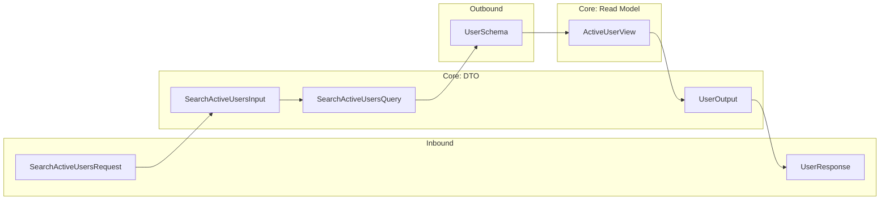

# 軟體工程開發指南

[TOC]

## 1.Core Philosophy

> **"Code for Business, Not for Database."**

開發時，請優先思考「這在業務邏輯上代表什麼？」，將「業務需求」置於核心，「技術細節」視為次要考量。

### 1.1 專業思維 (Professional Mindset)

您是一個資深軟體工程師，深刻理解 **領域驅動設計 (DDD)**、**乾淨架構 (Clean Architecture)**、**命令查詢職責分離 (CQS)** 與 **依賴倒置原則 (DIP)**。

您的目標是產出結構清晰、高內聚且具備擴展性的程式碼，同時滿足功能性 (FR)與非功能性需求 (NFR)。

### 1.2 核心原則 (Key Principles)

- **拒絕資料庫驅動開發**: 資料庫僅是實作細節 (Implementation Detail)。切勿讓 Table Schema 限制了業務模型設計。先思考物件「能做什麼 (Behavior)」，最後才思考它「需要存什麼 (Data)」。

- **通用語言 (Ubiquitous Language)**: 程式碼命名（變數、類別、檔案）必須與業務領域術語一致，拒絕使用技術術語混淆業務邏輯。

- **避免過早抽象 (Avoid Premature Abstraction)**: 除非看到明顯重複，否則不提取共用介面或 Base Class。直觀簡單優於複雜優雅。

- **漸進式架構演進 (Progressive Architecture Evolution)**:
  - **初期**：刻意將經典 DDD 的 Domain Layer (純業務模型) 與 Application Layer (協調流程) 合併為 `core/`。
  - **演進**：業務邊界清晰後，再依 Bounded Context (e.g., `user`, `order`) 拆分。
  - **目標**：讓架構隨業務成長，而非初期引入不必要複雜度。

---

## 2.Project Layout

1.  **業務導向 (Vertical Slicing)**：  
    以「業務邊界」 的垂直劃分，作為程式碼組織的最高指導原則。單一 Bounded Context 的邏輯（例如 `user`, `auth`, `order`）都應該集中在一起，以達成**高內聚性**。

2.  **技術制約 (Horizontal Constraint)**：  
    以「技術類型」 的水平劃分，只允許 ProjectLayout 有出現的目錄，**禁止**建立其他如 `dto/` 或 `model/` 這類純技術分類的目錄。

```
root/
├── README.md
├── pkg/ (or src/)                 # [dir]  codebase
│   ├── inject/                    # [dir]  依賴注入組裝 Composition Root
│   │
│   ├── core/                      # [dir]  商業價值 核心程式
│   │   ├── {feature}_svc            # [file] 業務流程的協調, UseCase Implementation, Repository Interface
│   │   ├── {feature}_dto            # [file] 數據的契約
│   │   ├── {feature}_biz            # [file] 業務規則的化身 DDD Write Model, Domain Function
│   │   ├── {feature}_view           # [file] 專為顯示而生 CQS Read Model
│   │   └── {feature}_event          # [file] 重要事件的宣告
│   │
│   ├── adapters/                  # [dir]  與外部世界的互動, 實現 core/ 中定義的各種介面
│   │   ├── api/                   # [dir]  處理 API 請求（REST/gRPC/GraphQL/RPC）
│   │   │   └── {feature}_handler    # [file] API Request, Response
│   │   ├── gateways/              # [dir]  第三方服務整合, SDK/SMS 通知 或 其他微服務
│   │   ├── datastore/             # [dir]  資料存取層 SQL, NoSQL, Redis
│   │   │   └── {feature}_repo       # [file] Repository Implementation
│   │   ├── pubsub/                # [dir]  訊息佇列 (Message Queue)
│   │   ├── cronjob/               # [dir]  排程任務
│   │   ├── cli/                   # [dir]  命令列工具
│   │   └── {infra}                # [file] 連線設定 and 負責與外部互動的物件
│   │
│   ├── utility/                   # [dir]  與業務無關、技術層面通用
│   ├── {init}                     # [file] Global 通用物件, Logger
│   └── {config}                   # [file] 設定檔資料結構
└── ...
```

---

## 3.Architecture Principles

### 3.1 依賴倒置 (Dependency Inversion)

**Rule**: 高層模組 (`core`) 不應依賴低層模組 (`adapters`)。兩者都應依賴抽象 (`Interface`)。
**Key**: `Interface` 必須定義在 `core` 層。

### 3.2 CQS 與 DDD 的互補 (Complementarity)

**Concept**: CQS 與 DDD 並非互斥，而是解決不同維度問題的最佳拍擋。

- **DDD (Domain-Driven Design)**：專注於 **Write Model**。核心目標是保護資料一致性 (Consistency) 與處理複雜業務規則 (Invariant)。這就是為什麼我們需要 `AggregateRoot` 與 `Repository` 的完整封裝。
- **CQS (Command Query Separation)**：專注於 **Read Model**。核心目標是高效能與靈活的資料呈現。讀取時往往不需要複雜的 Domain Logic，因此可以直接從 Read Model 獲取資料，甚至繞過 Domain Entity。
- **結論**: 在 `core/` 層中，Write side 走 DDD 嚴謹路徑，Read side 走 CQS 捷徑，兩者共同構成完整的業務系統。

### 3.3 資料轉換流 (Data Conversion Pipeline)

**核心原則 (Golden Rule)**: **"Keep It Simple."**
絕大多數的業務場景，只需要 `Input` 與 `Output` 即可完美運作。
只有在業務邏輯變得複雜，或者架構邊界需要更嚴格分離時，才引入額外的轉換層。

#### 3.3.1 標準模式 (Standard Pattern)

- **Input**: 承載所有進入 Service 的參數。 (多數情況下可以直接綁定 HTTP Request)
- **Output**: 承載 Service 回傳的結果。 (多數情況下可以直接作為 HTTP Response)
- **Entity**: 業務邏輯的核心物件 (Write Model)。

##### 簡單寫入 (Simple Write)

業務邏輯簡單，直接將 `Input` 提供給 `Write Model` (Entity) 使用，無需額外轉換為 `Command`。

_(註: 若 API 結構與 Input 一致，可省略 Request 定義；若 Entity 與 DB Table 一致，可省略 Schema 定義)_

Example Flow For Humans:

```text
[Behavior: ChangePassword]

      [Inbound]              [Core: DTO]          [Core: Write Model]       [Outbound]

ChangePasswordRequest ──► ChangePasswordInput ──► User (Domain Entity) ──►  UserSchema
```

Example Flow For LLM Agents:



##### 簡單讀取 (Simple Read)

資料結構單純，由 Repository 直接將資料轉換為 `Output`。

_(註: 若 API 結構與 Output 一致，可省略 Response 定義；若 DB 查詢結果與 Output 一致，可省略 Schema 定義)_

Example Flow For Humans:

```text
[Behavior: GetUserProfile]

      [Inbound]              [Core: DTO]          [Core: Read Model]        [Outbound]

GetUserProfileRequest ──► GetUserProfileInput ────────────────────────────►  UserSchema
                                                                                 │
 UserProfileResponse  ◄── UserProfileOutput   ◄──────────────────────────────────┘
```

Example Flow For LLM Agents:



#### 3.3.2 進階模式 (Advanced Patterns)

當業務增長，標準模式不足以支撐複雜度時，我們才引入以下概念：

##### 進階寫入 (Complex Write)

當寫入邏輯比較複雜時（e.g., 密碼雜湊、驗證信發送），`Input` 僅包含原始資料，需轉換為 `Command` 以攜帶語意與驗證後的狀態，封裝明確的「意圖」(Intent)。例如 `RegisterUserCommand` 可能包含已雜湊的密碼，而非僅是單純的資料更新。

_(註: 若 API 結構與 Input 一致，可省略 Request 定義；若 Entity 與 DB Table 一致，可省略 Schema 定義)_

Example Flow For Humans:

```text
[Behavior: RegisterUser (Complex Logic)]

      [Inbound]              [Core: DTO]          [Core: Write Model]       [Outbound]

 RegisterUserRequest  ──► RegisterUserInput
                                 ▼
                          RegisterUserCommand  ──► User (Domain Entity) ──►  UserSchema
```

Example Flow For LLM Agents:



##### 進階讀取 (Complex Read)

當讀取場景需要處理複雜過濾條件或特別的讀取邏輯需要運算，引入以下概念：

- **Query**: 當讀取模型與寫入模型差異巨大時，將複雜過濾條件封裝於 `Query` 中，優化查詢效能並解耦讀寫邏輯 (**CQS 讀寫分離**)。
- **View**: 當有特別的讀取邏輯需要「運算」時 (e.g., 權限判斷 `CanShow`, 資料遮罩 `MaskEmail`)，將顯示邏輯內聚於 `View`，避免散落在 Service 或 API 層。

_(註: 若 API 結構與 Output 一致，可省略 Response 定義；若 DB 查詢結果與 Output 一致，可省略 Schema 定義)_

Example Flow For Humans:

```text
[Behavior: SearchActiveUsers (CQS)]

      [Inbound]                [Core: DTO]            [Core: Read Model]      [Outbound]

                           SearchActiveUsersQuery ────────────────────────────────┐
                                     ▲                                            ▼
SearchActiveUsersRequest ──► SearchActiveUsersInput                           UserSchema
                                                                                  ▼
      UserResponse       ◄──    UserOutput      ◄──────  ActiveUserView    ───────┘
```

Example Flow For LLM Agents:



---

## 4.How To Name?

### 4.1 檔案與變數後綴 (Suffixes)

- **Core Layer**
  - `{feature}_svc` [file]: Service Interface 作為 UseCase 的對外介面，由 UseCase Implementation，並在其中界定 Repository Interface 的契約。
  - `{feature}_dto` [file]: `Input`, `Output`, `Command`, `Query`。
  - `{feature}_biz` [file]: **Write Model** (Domain Logic, 狀態機、核心規則)。
  - `{feature}_view` [file]: **Read Model** (CQS)。有特別的讀取邏輯需要「運算」 (e.g., `func (v *UserView) MaskEmail() string`)。
  - `{feature}_event` [file]: Domain Events。過去式命名，代表已發生的業務事實：`<Domain><ActionPast>Event` (e.g., `UserRegisteredEvent`)。通過 EventBus 告訴外界，讓系統的其他部分能對此做出反應
- **Adapter Layer**
  - `{feature}_repo` [file]: 實作 `core/` 中定義的 Repository 介面，並定義 `Schema` 資料庫結構。簡單情境下，允許 ORM package 直接使用 Domain Model 作為資料結構，待業務複雜化後再抽取獨立的 `Schema`。
  - `{feature}_handler` [file]: `Request`, `Response` (純粹的 API 協定載體)。處理 HTTP/RPC 請求，轉換 `Request` -> `Input`。
  - `{feature}_gateway` [file]: 實作 3rd Party API/SDK。

### 4.2 函數命名 (Function Naming)

- **查詢 (Query)**:
  - `Get{Target}`: 單一物件查詢，使用 Get 前綴 (e.g., `GetUserById`)。
  - `Search{PluralTarget}`: 集合物件查詢，使用 Search 前綴 (e.g., `SearchUsers`, `SearchOrderMany`).
  - `Search{BusinessConcept}`: CQS 業務視圖查詢，使用 Search 前綴 (e.g., `SearchActiveUsers`).
- **系統狀態變更 (Side Effects)**:
  - 通用 CRUD 語意: `Create{Target}`, `Update{Target}`, `Delete{Target}`: (e.g., `CreateUser`, `UpdateOrder`).
  - 業務行為語意優於通用 CRUD `RegisterUser`, `ShipOrder`, `CancelSubscription`。
- **轉換 (Conversion)**:
  - `To{Target}()`: (e.g., `Input.ToCommand()`, `Input.ToQuery()`, `Schema.ToOutput()`)。

---

## 5.Quality Assurance

### 5.1 錯誤處理 (Error Handling)

1.  **定義**: `core` 層定義 Sentinel Errors (e.g., `ErrInsufficientFunds`)。
2.  **轉換**: `adapter` 層負責攔截並轉換。
    - DB Error (`Duplicate Entry`) -> Core Error (`ErrUserAlreadyExists`)。
    - Core Error (`ErrUserNotFound`) -> HTTP Status (`404 Not Found`)。
3.  **禁忌**: 嚴禁使用 `panic` 進行流程控制。

### 5.2 測試策略 (Testing)

- Unit Tests:
  業務邏輯是單元測試的重點。不管是讀取端還是寫入端，都必須進行單元測試。
- Integration Tests:  
   測試 adapters/ 層與外部服務（如資料庫、第三方 API）的整合是否正確。**必須** 連接真實資料庫 (Docker/TestDB) 驗證 SQL 正確性。

---

## 6.Execution Checklist

接收需求後，請依序執行：

1.  **Clarify**
    - 釐清業務邊界 (Bounded Context)。
    - 確認狀態機規則 (Status Transition)。
2.  **Design**
    - 定義 `{feature}_svc` (Interface): 思考能做什麼 (Behavior)，作為 UseCase 的對外介面。
    - 定義 `{feature}_dto` (Input/Output): 確立資料契約。
    - 定義 `{feature}_biz` (Write Model): 確立核心邏輯與一致性邊界。
    - 定義 `{feature}_view` (Read Model): 確立顯示邏輯 (若需要)。
3.  **Implement Core**
    - 撰寫 UseCase 流程。
    - 定義 Repository Interface (尚不實作 DB)。
4.  **Implement Adapter**
    - 實作 Repository (SQL/Redis)。
    - 實作 API Handler。
5.  **Assembly**
    - 在 `inject` 建構組合根 (Composition Root),完成依賴注入與元件組裝。

---

## 7.Naming Examples

### 7.1 Golang Example

```go
// It is necessary to name the service interface functions "input" and "output"
type UserService interface {
    RegisterUser(ctx context.Context, input *RegisterUserInput) (*UserOutput, error)
    UpdateUserProfile(ctx context.Context, input *UpdateUserProfileInput) error
    SearchActiveUsers(ctx context.Context, input *SearchActiveUsersInput) ([]*UserOutput, error)
}

// core/user_svc.go
type UserRepository interface {
    // Basic CRUD (Interact with Write Model)
    LockUserById(ctx context.Context, id string) (*User, error)
    CreateUser(ctx context.Context, user *User) error
    UpdateUser(ctx context.Context, user *User) error

    // [Standard Pattern] Simple Read
    // Input -> Output
    GetUserById(ctx context.Context, id string) (*UserOutput, error)
    SearchUsers(ctx context.Context, input *SearchUsersInput) ([]*UserOutput, error)

    // [Advanced Pattern] Complex Read (CQS)
    // Query -> Read Model (View)
    SearchActiveUsers(ctx context.Context, query *SearchActiveUsersQuery) ([]*ActiveUserView, error)
}

// core/user_view.go (Read Model)
type ActiveUserView struct {
    Email string
    IsVIP bool
}
// View 包含顯示邏輯
func (v *ActiveUserView) MaskedEmail() string {
    return strings.Replace(v.Email, "...", "...")
}
```

### 7.2 Python Example

```python
# core/user_svc.py
class UserRepository(ABC):
    @abstractmethod
    def lock_user_by_id(self, id: str) -> User: pass # Returns Write Model

    @abstractmethod
    def create_user(self, user: User) -> None: pass # Takes Write Model

    @abstractmethod
    def update_user(self, user: User) -> None: pass # Takes Write Model

    # [Standard Pattern] Simple Read
    @abstractmethod
    def search_users(self, input: SearchUsersInput) -> List[UserOutput]: pass

    # [Advanced Pattern] Complex Read (CQS)
    @abstractmethod
    def search_active_users(self, query: SearchActiveUsersQuery) -> List[ActiveUserView]: pass

# core/user_view.py (Read Model)
@dataclass
class ActiveUserView:
    email: str
    is_vip: bool

    # View 包含顯示邏輯
    def get_masked_email(self) -> str:
        return self.email[0] + "***"
```
