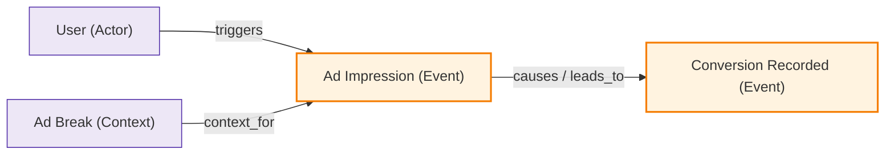

# Domain Ontology Report Template & Generation Guide

依據知識工程（Knowledge Engineering / W3C OWL 2）標準，當完成 `<system-name>.ontology.yml` 抽取後，應依據本指南將 YAML 結構化內容渲染為一份人類與 AI 均可清晰理解的 **`<system-name>.ontology.md` 領域本體論分析報告**。

> [!IMPORTANT]
> **排版與架構規範**：
> 1. **採用 Bullet List 結構**：跨上下文對齊禁止使用橫向寬表格（避免因上下文數量過多導致排版破裂），統一採用條列式（Bullet List）階層展開。
> 2. **嚴格區分架構分層與限界上下文**：
>    - **架構技術分層（Layers）**：`api`, `storage`, `dto`, `middleware`。這是單一服務內部的技術管線，**嚴禁**當作 Bounded Context。
>    - **業務限界上下文（Bounded Contexts）**：`AdDecision`, `Settlement`, `Billing`, `CRM` 等業務子領域與通用語言邊界。

---

# 報告模板結構（Markdown Template）

```markdown
# 領域本體論分析報告：{{ system.name }}

> **領域範疇**：{{ system.domain }}  
> **系統描述**：{{ system.description }}  
> **本體版本**：v{{ system.version }} | **審核狀態**：{{ system.review_status }} | **代碼座標**：`{{ system.commit_sha }}`  
> **產生時間**：{{ system.generated_at }}

---

## 1. 本體視覺化圖表（Ontology Diagrams）

### 1.1 概念與關係語意圖（Concept & Relational Semantic Graph）
```mermaid
graph TD
    %% 概念節點（含上下位關係）
    classDef concept fill:#e1f5fe,stroke:#0288d1,stroke-width:2px;
    classDef external fill:#f5f5f5,stroke:#9e9e9e,stroke-width:1px,stroke-dasharray: 5 5;

    %% 範例節點宣告
    AdRequest["Ad Request<br/><i>(commercial_transaction)</i>"]:::concept
    ConversionEvent["Conversion Event"]:::concept
    AdvertiserPlatform["Advertiser Tracking Platform"]:::external

    %% 關係連線（標註動詞謂詞與代數特徵）
    AdRequest -->|produces<br/><i>[functional]</i>| ConversionEvent
    ConversionEvent -.->|reported_by| AdvertiserPlatform
```

### 1.2 世界事件與因果圖（World Event & Causal Graph）


---

## 2. 跨限界上下文語意對齊（Cross-Context Semantic Alignment）

> 解決各業務限界上下文（Bounded Contexts）之間的命名分歧，支援垂直擴充至任意多個上下文：

- **`customer_account`（規範本體概念）**
  - **語意關係**：同義異名（Semantic Equivalence）
  - **消歧說明**：不同業務領域命名不同，本質為同一商業與法律主體。
  - **各限界上下文映射 (Context Projections)**：
    - `ad_decision`（廣告決策）：`Advertiser` (`internal/domain/decision.Advertiser`)
    - `settlement`（結算履約）：`ContractAccount` (`internal/domain/settlement.Account`)
    - `billing`（財務帳務）：`PayerAccount` (`internal/billing.Account`)
    - `crm`（客戶關係）：`Client` (`internal/crm.ClientModel`)

- **`conversion_event`（規範本體概念）**
  - **語意關係**：同義異名（Semantic Equivalence）
  - **消歧說明**：投放端視為成效指標，結算端視為待對帳事件，帳務端視為收費單據。
  - **各限界上下文映射 (Context Projections)**：
    - `ad_decision`（廣告決策）：`AttributedOutcome`
    - `settlement`（結算履約）：`ConversionEvent`
    - `billing`（財務帳務）：`ChargeableItem`

- **`conversion_id` vs `click_id`（衝突詞彙消歧）**
  - **語意關係**：異義衝突消歧（Semantic Conflict / Non-Equivalence）
  - **消歧說明**：跨模組對帳時常被混用，但一次點擊可能產生多次轉換，兩者為一對多非等價關係。
  - **各上下文表現**：
    - `traffic_tracking`：`click_id`（點擊唯一追蹤標識）
    - `advertiser_platform`：`conversion_id`（廣告主端轉換識別碼）

### 受治理詞彙表（Governed Vocabulary）
- **`conversion_id`**：廣告主追蹤平台回傳之唯一轉換識別碼。
  - *別名 (Aliases)*：`conv_id`, `click_conv_token`
  - *衝突與分歧記錄 (Conflict Notes)*：`click_id` 與 `conversion_id` 在跨模組對帳時常被混用，但一次點擊可能產生多次轉換，兩者為一對多非等價關係。

---

## 3. 核心領域概念與數據屬性（Concepts & Properties）

### 3.1 `ad_request` (Ad Request)
- **概念本質**：播放器在廣告時段（Ad Break）發起之單次商務決策請求。
- **上位概念 (SubClassOf)**：`commercial_transaction`
- **互斥概念 (DisjointWith)**：`organic_content_request`
- **跨限界上下文映射 (Context Mappings)**：
  - `ad_decision`: `PlacementRequest` (`internal/domain/decision.Request`)
  - `traffic_routing`: `InboundAdSlot` (`internal/domain/routing.Slot`)
- **數據屬性 (Data Properties)**：
  - `placement`：所請求之商務廣告版位識別與版位規格。

---

## 4. 聲明對象關係與代數特徵（Declared Relations）

- **`ad_request` $\xrightarrow{\text{produces}}$ `conversion_event`**
  - **反向關係 (Inverse)**：`produced_by`
  - **代數特徵 (Characteristics)**：`functional`（單值約束）
  - **業務關聯**：單次廣告曝光後續可能產生轉換。

- **`conversion_event` $\xrightarrow{\text{reported_by}}$ `advertiser_platform`**
  - **反向關係 (Inverse)**：`reports`
  - **業務關聯**：轉換事件由外部廣告主平台回報。

---

## 5. 世界事實與事件型態（World Events & Occurrences）

### 5.1 `conversion_event` (Conversion Event)
- **客觀事實敘述**：廣告主端確認之成效轉化事實（如購買、註冊）。
- **參與主體 (Participants)**：`ad_request`, `user`
- **作用對象 (Target)**：`ad_creative`
- **事件度量 (Properties)**：`charged_amount`, `attributed_timestamp`

---

## 6. 形式化邏輯公理與約束（Axioms & Constraints）

### 6.1 `cool_off_7d` (7天頻次冷卻公理)
- **公理敘述**：同一使用者在 7 天內不可再次觀看同一廣告素材。
- **適用條件 (Condition)**：該使用者過去 7 天內已曝光過該素材。
- **強制約束 (Action)**：將該素材自候選決策集合中剔除。
- **置信度與來源**：`0.9`（依據商務合約註解）。

---

## 7. 巨觀業務流程（Macro Domain Workflows）

### 7.1 `settle_nightly` (夜間結算流程)
- **觸發條件**：夜間批次排程啟動。
- **業務步驟**：
  1. 檢索所有待結算之 `conversion_event`。
  2. 依合約單價進行扣款並標記為已結算。
- **輸入概念**：`conversion_event` | **輸出概念**：`cleared_settlement`

---

## 8. 認識論缺口與待決問題（Epistemic Gaps & Open Questions）

> 依據開放世界假設（OWA），記錄代碼未明確載明或存在矛盾之待決領域知識：

- **`q_attribution_window` [P1]**
  - **待決問題**：一筆 `conversion_event` 是否可能歸因至多個 `click_id`？
  - **關聯構件**：`conversion_event`
  - **AI 建議預設值**：建議預設為一對多，待領域專家確認。
```

---

# 產出規範與質量原則

1. **排版延展性**：跨限界上下文對齊與關係**以 Bullet List 條列為主**，禁止使用橫向超寬表格，確保在 5~10+ 個 Bounded Contexts 時依然具備極高可讀性。
2. **語意純粹性**：報告中嚴禁出現技術資料庫型別（`bigint`, `varchar`）、軟體調用指令（`Command`）、RPC / MQ 訊息佇列等實作細節。
3. **限界上下文正名**：跨上下文對齊**只可記錄業務領域上下文**（如 `Billing`, `CRM`, `Settlement`, `Delivery`），**絕對嚴禁將技術架構分層（`api`, `storage`, `dto`）誤當作 Bounded Context**。
4. **圖表一致性**：Mermaid 圖表的節點 ID 必須與 YAML 中的 `concepts[].id`、`events[].id` 完全一致。
5. **認識論透明度**：所有 `confidence < 0.5` 的推論必須在「認識論缺口」中列出，並附帶建議預設值。
