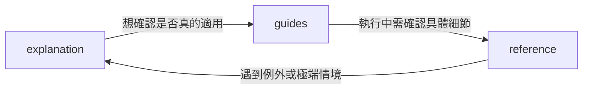
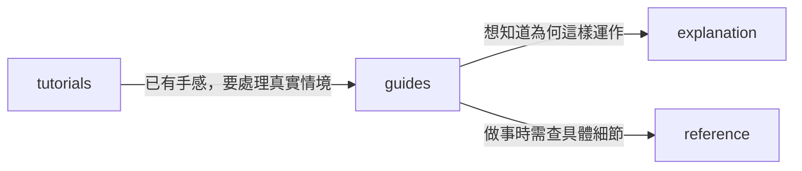
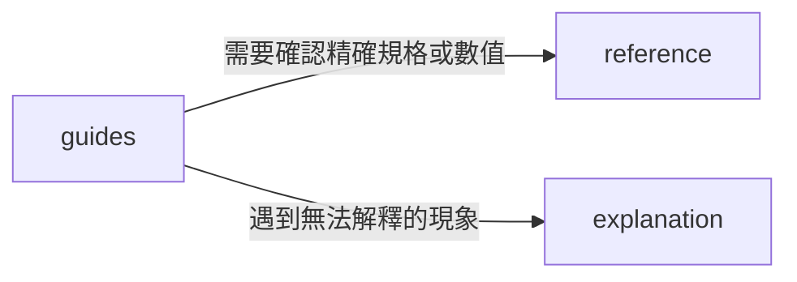

# doc-validator

驗證文檔是否把「對的內容放在對的地方，並保持適度粒度」。核心做法：每份文件先歸類並評估粒度，再逐項檢查邊界、結構與連結，最後輸出違規清單與搬移 / 拆分 / 合併建議。判斷分類與粒度大小全依商業邏輯與實際情境裁量，無固定標準答案。規則只在本文定義一次，其他章節僅引用。

## Core Principles

- **單一職責**：一份文件只服務一種讀者需求。混雜會讓讀者在需要時找不到、在不需要時被干擾。
- **避免過度碎片化（情境裁量）**：除了拆分混雜內容，亦需避免產生過多內容單薄、零散的微型文件。文件的合併或拆分應依商業邏輯與使用者任務情境裁量，以閱讀順暢、心智負擔最低為準，無死板的量化標準。同類型且緊密關聯的小主題，應優先合併為單一文件。
- **導航不承載內容**：intent-doc 只做分流與跳轉。

目錄與檔名一律全小寫；架構清單只展開到主要目錄層級，不列到具體檔案。

```text
docs/
├── tutorials/
├── guides/
├── reference/
├── explanation/
├── decisions/
└── testcases/
```

## Document Types

### Part 1: Intent-doc

來源：自訂設計，**不屬於 Diataxis**，Diataxis 本身沒有規定讀者動線。以下規則是建議，審查時用來判斷「讀者能否找到入口」，不是硬性規範。內容會引用 Part 2 的文件類型名稱，但導航規則本身的來源是自訂。

intent-doc 是中央路由器，載體為文檔首頁 `index.md` 或倉庫根目錄 `README.md`。目標：讀者 10 秒內完成意圖分流。

**建議區塊**
1. Hero 雙軌卡片：並列「快速上手（tutorials）」與「架構與理念（explanation）」。
2. Task-driven 快速通道：常見生產任務分類入口（部署、配置、監控、故障排查），連結至 guides。
3. 四象限全域目錄：tutorials、guides、reference、explanation 完整清單，供回訪者索引。
4. 工程治理入口：通往 decisions/ 與 testcases/。

**三條閱讀路徑**

每條路徑只規定「入口」與「跳轉觸發條件」，不規定固定順序。箭頭上的文字是讀者離開當前文件、前往下一類文件的原因。

1. Top-down（先全貌、後細節）：讀者需要先建立整體心智模型，才能判斷是否適合、該從哪裡下手。入口是 explanation，細節在需要驗證或實作時才查。例如：
- 行銷：評估新平台前，先看懂它的定位與運作邏輯。
- PM：接手新產品線時，先掌握整體脈絡再拆需求。
- 工程：選型時，先看系統邊界與取捨。
- 學習：進入新領域時，先看整體地圖再進細節。



2. Bottom-up（先體感、後原理）：讀者需要先親手完成一次，取得信心與直覺，再回頭理解背後的原因。入口是 tutorials。例如：
- 行銷：先照範例發出第一則活動，再理解受眾分群的邏輯。
- PM：先照範本跑完一次規劃流程，再理解每個步驟的目的。
- 工程：先跑出第一個成功輸出，再理解底層機制。
- 學習：先做一個小練習，再回頭讀理論。



3. Task-driven（先任務、後必要資訊）：讀者帶著明確的目標或問題而來，只想取得完成任務所需的最少資訊。入口是 guides。例如：
- 行銷：活動明天上線，需要完成追蹤設定。
- PM：本週要交出路線圖簡報。
- 工程：服務出現異常，需要排查並恢復。
- 學習：考試前要完成某類題型的練習。



**審查只檢查兩件事**
1. 三條路徑的入口（explanation、tutorials、guides）在首頁或 README 是否找得到。
2. 入口文件是否有連結，能通往圖中的跳轉目標。

Top-down 讀者不應被迫先動手練習才能看全貌。小型專案（如單一工具或文檔少於 5 份）可只提供部分入口，不應僅因路徑不全就扣分。

**README.md 差異**：輕量版 intent-doc，只保留極簡 quickstart、架構摘要與各目錄跳轉連結，不貼全量 API 字典或完整安裝手冊。

### Part 2: Diataxis 框架

來源：
- Diataxis 官方 https://diataxis.fr/ （tutorials-how-to、reference-explanation 兩篇差異專題特別有助於判斷模糊案例）。
- Divio Documentation System https://docs.divio.com/documentation-system/introduction/ （四象限的原始介紹，提供「各類型只有一個任務」的原則與烹飪類比）。

僅包含 tutorials、guides、reference、explanation 四個象限。

核心原則：每一類文件只有一個任務，各自需要不同的寫法，必須明確分開、互不混雜。讀者在使用過程的不同階段需要不同類型的文件，混雜會讓文件被同時往多個方向拉扯。

分類原則：依「學習 vs 工作」與「行動 vs 認知」分類，而非按難度。tutorials 與 guides 的分界是「學習體驗 vs 生產任務」，不是入門 vs 進階。

#### tutorials
- **Purpose**：帶新手取得第一次成功（學習 + 行動）。
- **Reader**：零心智模型，不預設工具背景與排錯能力。
- **Environment**：完全受控，固定版本與素材，無外部變數。
- **Must**：單一線性路徑；每步有預期輸出；承諾必定成功；卡住即視為文檔缺陷（責任在作者）；結尾導向 guides 與 explanation；語氣溫和、陪伴式。
- **Must Not**：解釋架構原理、提供分支或替代方案、省略基礎指令、依賴未固定版本的外部資源。
- 骨架：前置準備 -> 最小可用步驟 -> 預期輸出驗證 -> 下一步導流。
- 類比：教小孩學做菜的一堂課（一堂課，讓新手能開始上手）。

#### guides
- **Purpose**：完成特定生產任務（工作 + 行動）。
- **Reader**：有基礎能力，已知目標。
- **Environment**：真實世界，含依賴衝突與不可控變數。
- **Must**：包含真實條件分支（如 Docker vs 裸機）；假設讀者有能力，不重複解釋基本指令；參數連結至 reference；需要原理說明處連結至 explanation（僅連結，不內嵌論述）；語氣專業、俐落。
- **Must Not**：列全量參數字典、論述架構演進。
- 骨架：前置條件 -> 操作步驟（含分支） -> 成果驗證 -> 疑難排解。
- 類比：食譜書裡的一道食譜（一連串步驟，解決一個具體問題）。

#### reference
- **Purpose**：提供權威、客觀的事實規格（工作 + 認知）。
- **Reader**：知道自己在查什麼。
- **Environment**：無環境依賴，結構鏡像程式碼。
- **Must**：精確、即時更新；以清單、簽名、結構化欄位呈現；條目附相關 guides 與 explanation 連結（僅連結，不內嵌論述）。
- **Must Not**：操作教學、主觀評價或建議、架構哲學。
- 骨架：簽名宣告 -> 參數規格（型別 / 預設值 / 約束） -> 回傳結構 -> 錯誤碼 -> 最小調用範例。
- 類比：百科全書中的一個條目（乾燥的描述）。

#### explanation
- **Purpose**：說明系統為何如此設計與取捨（學習 + 認知）。
- **Reader**：有實作經驗，想理解全局。
- **Environment**：抽象的思考空間。
- **Must**：主題式論述；多角度與替代方案權衡；提及具體實踐或操作場景時連結至 guides；提到模組時連結其 reference；提到歷史選型時單向連結 decisions 對應的 ADR。
- **Must Not**：逐步操作指令、速查參數表、只談單一元件細節。
- 骨架：背景與挑戰 -> 核心機制 -> 為何這樣設計（取捨） -> 替代方案對比。
- 類比：一篇談烹飪社會史的文章。

### Part 3: Engineering Governance

來源：工程治理實務，**不屬於 Diataxis**，獨立於四象限之外，用來隔離會污染四象限的內容。包含 decisions、testcases 兩個目錄。

分類原則：現況與歷史分離。explanation 描述系統「現在」如何運作；歷史決策進 decisions/。測試細節進 testcases/，不進 guides。

#### decisions
- **Purpose**：決策歷史日誌，以 ADR 格式撰寫；追加式、不可變、帶時間戳。
- **Must**：記錄當時背景、評估過的替代方案與後果；舊 ADR 不改原文，只標記 Outdated 並註明由哪個 ADR 取代（如 `Outdated: replaced by ADR-0012`）。
- **Must Not**：描述系統現況（那是 explanation）。
- 骨架：狀態 -> 背景 -> 決策 -> 結果評估（正負面影響）。

#### testcases
- **Purpose**：系統行為的客觀驗收契約，服務 QA、CI 與核心開發者。
- **Must**：邊界案例、異常斷言、覆蓋矩陣皆留在此。
- **Must Not**：教使用者操作。「如何執行測試」屬 guides；「輸入輸出型別」屬 reference。
- 骨架：前置條件 -> 輸入邊界 -> 預期斷言行為。

## Validation Process

1. **Identify & Granularity**：判定每份文件的類型與粒度。無法歸類或橫跨兩類者標記為混雜並建議拆分；反之，若多份同類型文件內容過少、零散且業務邏輯緊密相依，應標記過度碎片化並建議合併。
2. **Validate boundaries**：對照 Document Types 的 Must / Must Not 檢查內容污染。
3. **Validate structure**：對照各類型骨架檢查缺漏與順序。
4. **Validate cross-links**：對照各類型 Must 中的連結要求檢查。
5. **Report**：依「輸出格式」回報違規。

審查整個 docs/ 時，先檢查 intent-doc 與目錄結構，評估整體文件粒度（避免過度碎片化），再逐份檢查文件。

### 污染搬移對照

| 發現 | 搬至 |
|---|---|
| tutorials 含架構原理 | explanation |
| guides 含全量配置清單 | reference |
| guides 含大量測試斷言 | testcases |
| testcases 含「如何執行測試」教學 | guides |
| reference 含操作教學 | guides |
| reference 含心得或建議 | explanation |
| explanation 含操作步驟 | tutorials 或 guides |
| explanation 含過期歷史 | decisions |
| ADR 描述現況 | 改寫進 explanation，ADR 保持歷史原貌 |

## Validation Checklist

- [ ] 每份文件已識別類型，且只屬於一個類型
- [ ] 粒度適中：無多職責過載，亦無過度碎片化（同類型零散、單薄的內容已依業務邏輯適度合併）
- [ ] 無跨類型內容污染（依各類型 Must Not 與「污染搬移對照」）
- [ ] 結構符合各類型骨架定義（無缺漏關鍵階段且順序正確）
- [ ] Cross-link 符合各類型 Must 的連結要求
- [ ] intent-doc 含建議區塊，且讀者能找到適合自己的入口（小型專案可部分省略）
- [ ] README 保持精簡
- [ ] 目錄與檔名全小寫，架構清單未展開到檔案

## Confidence Score

審查結尾給一個 0-100% 的「信心指數」，代表你有多大把握認為這份文檔（或體系）可以直接交付給讀者使用。**90% 以上才算合格**。

這是質化判斷，不是把 Checklist 勾選數換算成百分比。讀完全部內容後，以讀者視角整體評估：讀者能否在對的地方找到需要的東西、是否會被錯放的內容誤導或卡住。一項嚴重違規（例如 tutorials 無法照做、reference 有錯誤規格）可以讓分數低於 90%，即使其他項目全數通過；數個無傷大雅的小瑕疵也可能仍維持在 90% 以上。

錨點參考：

| 信心指數 | 意義 |
|---|---|
| 95-100% | 邊界、結構、連結皆乾淨，完全確信可交付 |
| 90-94% | 合格；僅有不影響讀者使用的微小瑕疵 |
| 70-89% | 大致可用，但有明確的邊界污染或缺漏，需修正後重審 |
| 40-69% | 多處職責混雜，或導航嚴重缺失導致讀者找不到入口 |
| 0-39% | 結構性問題，幾乎需要重寫 |

評分規則：
- 附上 2-4 句理由，說明為什麼是這個分數、最拉低分數的是什麼，讓使用者能判斷質化判斷是否合理。
- 低於 90% 時，列出「升到合格所需的最少修正」，不要泛泛而談。
- 資訊不足時（例如只拿到部分文件）不要硬給高分；說明受限範圍，並依已見內容保守評分。
- 修正後重審時重新評分，不沿用舊分數。

## Common Anti-patterns

各類型的 Must Not 與「污染搬移對照」已涵蓋內容污染，這裡只列它們沒有涵蓋的整體性錯誤：

- 強迫所有人先動手練習才能看全貌
- 過度碎片化（Over-fragmentation）：機械式拆分出大量只有寥寥數行的微型文件，增加讀者跳轉摩擦與維護負擔，未依業務情境與閱讀流暢度適度合併

## 輸出格式

審查報告固定使用以下結構：

```markdown
# 文檔審查報告
## 摘要（整體符合度與最嚴重的 3 個問題）
## 違規清單
| 檔案 | 判定類型 | 違規 | 建議動作（搬移 / 拆分 / 合併 / 刪除） |
## Cross-link 缺漏
## Checklist 結果
## 信心指數（0-100%，>= 90% 合格）
- 分數與判定（合格 / 不合格）
- 理由（2-4 句）
- 未達 90% 時：升到合格所需的最少修正
```

範例：
Input：`docs/guides/deploy.md` 內含 40 行完整 config 鍵值表與一段 2019 年改用 etcd 的原因。
Output：違規 1：全量配置表屬 reference，搬至 `reference/config.md` 並於 guide 連結；違規 2：etcd 選型歷史屬 decisions，新增 ADR 並由 explanation 連結。信心指數 78%（不合格）：兩項污染都會讓讀者在任務中途被打斷，但步驟本身正確；完成上述兩項搬移後預期可達合格。
